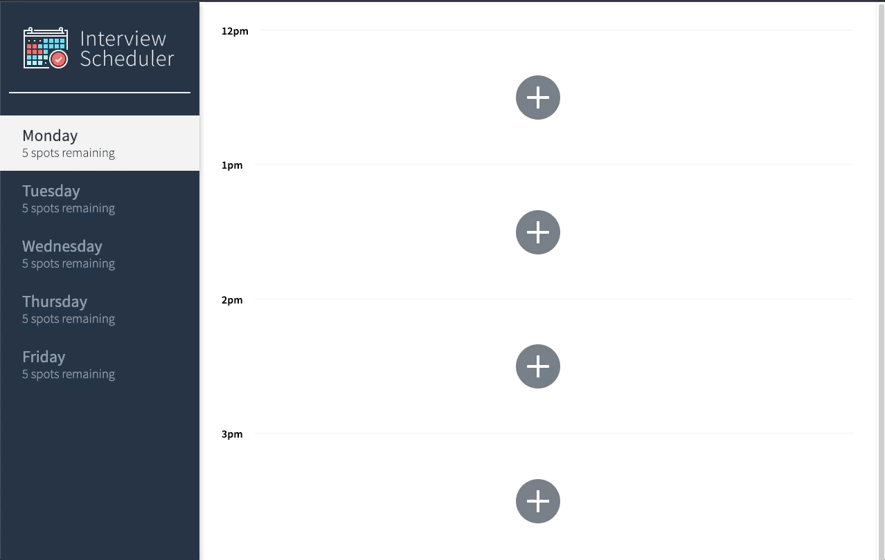

# Interview Scheduler


Using the latest tools and techniques, we build and test a React application that allows users to book and cancel interviews. We combine a concise API with a WebSocket server to build a realtime experience.

## Final Product



<figcaption>A live version of application can be found at <a href="https://chic-wisp-b55c42.netlify.app/">https://chic-wisp-b55c42.netlify.app/</a></figcaption>

## Primary Technologies Used

* React
* Webpack, Babel
* Axios
* WebSockets
* Storybook, Webpack Dev Server, Jest, Testing Library, Cypress


## Setup

Install dependencies with `npm install`.

## Running Webpack Development Server

```sh
npm start
```

## Running Jest Test Framework

```sh
npm test
```

## Running Storybook Visual Testbed

```sh
npm run storybook
```

## Features

Interview scheduler is a React application that allows user to book and cancel interviews. Application is connected to an API that was provided by Lighthouse Labs for this educational project.

The goal of this project was to get familiar with building a React application and performing tests with modern testing methods. The application was created using the Create React App. Unit and Integration testing was done using Storybook, Jest & Testing Library. End to end testing was performed with Cypress.


## Stretch

The application was updated to include a WebSocket connection so that schedule updates made by other users are updated in realtime.

Additionally the git repository has been connected with CircleCI to automate the testing of updates to the Master branch and deploy to Production branch.

Upon updates to the Production branch, the application is deployed using Netlify. A live version of the application can be seen at https://chic-wisp-b55c42.netlify.app/.
